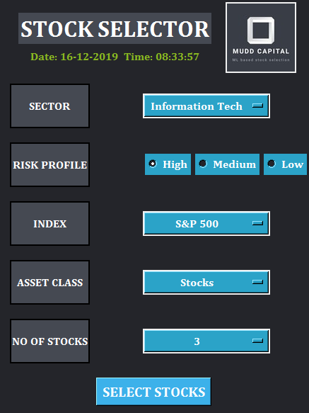
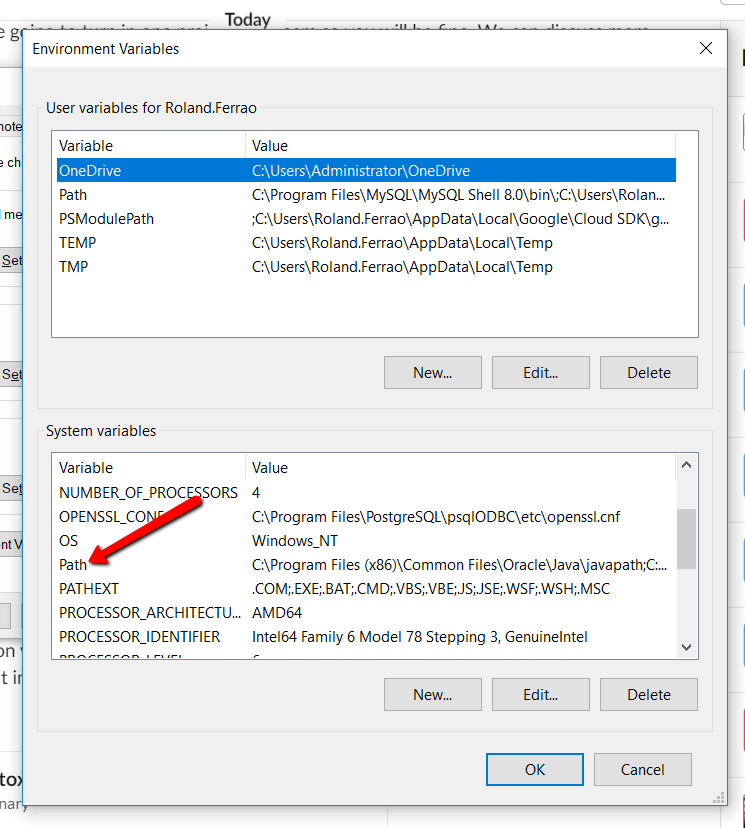
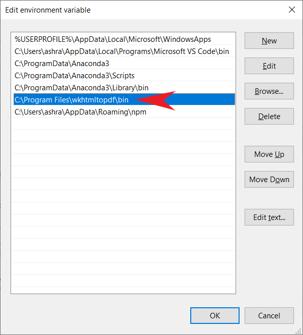

# Stock Selector (SS)
     

## Stock Selector uses machine learning algorithms to suggest stocks that have a higher probability of beating the sector index
* SS suggests stocks based on sector, risk profile, index, and number of instruments (e.g. Stocks)
* Calculations includes ~8 years of historical stock data
* One can input any different combinations of number of instruments and run   the Stock Selector to get suggestions on stocks within the reports folder
* Below is a screenshot of the user interface:




## How it works
1. Clone the repo to your local drive.
2. From your terminal locate the [\frontend](/frontend) folder within the repo and in the terminal type ```python main.py``` and Hit Run.
3. Once you hit Run the SS pops up. Select Sector, market cap, index (Sector ETF), asset class (stocks), and no of instruments.
4. Hit SELECT STOCKS once all the details are entered and the SS will run all the machine learning models and scrape stock summaries from Yahoo Finance on the backed to generate a report in the reports folder.
5. Each report is time_stamped so generate as many reports you want with different number of stocks across sectors.


## Usage
The Stock Selector can be used by analysts who want to do a quick discovery on stocks that have a higher probability of beating the index as well as investors who want to understand which stocks to invest in based on their requirements.
The Stock Selector report has the below sections:
* **User Selection**: This displays all the different inputs that were provided by an individual.
* **Stock Summaries**: Suggests different stocks to invest in based on your inputs. The number of summaries are based on the number of stocks one selected within the input screen.    


## Requirements and Configuration
* All requirements and dependencies are in the build-requirements folder.
* The only other configuration is to run the wkhtmltox-0.12.5-1.msvc2015-win64.exe file in the frontend/archives folder.
* Once the config is run the user needs to add the path to their System - path variable. Below is an image of where one could find that:





Have fun with the Stock Selector! :+1:

## Disclaimer
Developers of the SS are not registered as a securities broker-dealer or an investment adviser either with the U.S. Securities and Exchange Commission (the “SEC”) or with any state securities regulatory authority. We are not licensed to provide investment advice. Use SS suggestions at your own discretion.